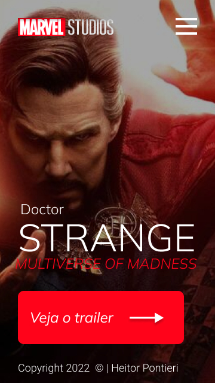

# DocStrange
Projeto feito durante as aulas de Linguagem de Marcação, LIMA no [SENAI Jandira](https://jandira.sp.senai.br/) pelo aluno Heitor Pontieri de Oliveira no curso de Desenvolvimento de Sistemas com a instrução do Prof. [Fernando Leonid](https://github.com/fernandoleonid)

 

---

## Objetivo do Projeto
O objetivo era criar uma landing page com base no design feito no Figma, aprendendo a estrutura de HTML,CSS, JavaScript e conceitos de responsividade, o tema escolhido foi o filme do Doutor Estranho que é um filme recém-lançado e foi usado sem pretenção alguma de propaganda ou marketing do filme

---
## Landing Page
Landing page são páginas com foco em cativar o usuário dentro da página e vender um produto ou comentar algo, páginas assim possuem uma estética minimalista comparada com os sites tradicionais

---
## Tecnologias usadas
- HTML 5
- CSS 3
- JavaScript
- Figma

---
## Aparelhos Suportados

- Computadores com acesso a internet
- Celulares independe do sistema operacional

## Links 
- [Resultado Final](https://heitorpontieri.github.io/DocStrange/)
- [Design Original](https://www.figma.com/file/JG8EUViTlq6iYZX1SQjAnk/Lima-Strange?node-id=0%3A1)
- [Repositório](https://github.com/HeitorPontieri/DocStrange)

